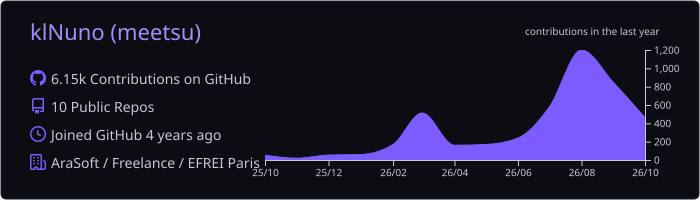

### Projects

- [accshift](https://github.com/klNuno/accshift) - Switch gaming accounts on Windows, macOS, and Linux.
- [Boite](https://github.com/beboite/boite) - A terminal workspace for coding agents. ([CLI version (legacy)](https://github.com/beboite/boite-legacy))

### Small projects

- [Spotivita](https://github.com/klNuno/spotivita) - Play Spotify on the PS Vita, with your library, search, artist pages, and Spotify Connect.
- [Windows Bagarre](https://github.com/klNuno/windows-bagarre) - Debloat and tune a fresh Windows 11 install for gaming.
- [fastpick](https://github.com/beboite/fastpick) - Pick your coding agent, provider, and model from the terminal (+ a roulette if you cannot decide).
- [fast-mcp-ssh](https://github.com/klNuno/fast-mcp-ssh) - SSH, SFTP, and remote screenshots for AI agents in one Rust binary.
- [PriceHover](https://github.com/klNuno/PriceHover) - Convert prices to another currency by hovering over them in your browser. (Supporting Crypto soon)
- [AlarmeMeian](https://github.com/klNuno/AlarmeMeian) - Manage Meian home alarms from Android.
- [HEIC to JPG](https://github.com/klNuno/heic-jpg-converter) - Convert HEIC images to JPG.

 

  

<picture>
  <source media="(prefers-color-scheme: dark)" srcset="https://raw.githubusercontent.com/klNuno/klNuno/output/snake-dark.svg">
  <source media="(prefers-color-scheme: light)" srcset="https://raw.githubusercontent.com/klNuno/klNuno/output/snake.svg">
  
</picture>

